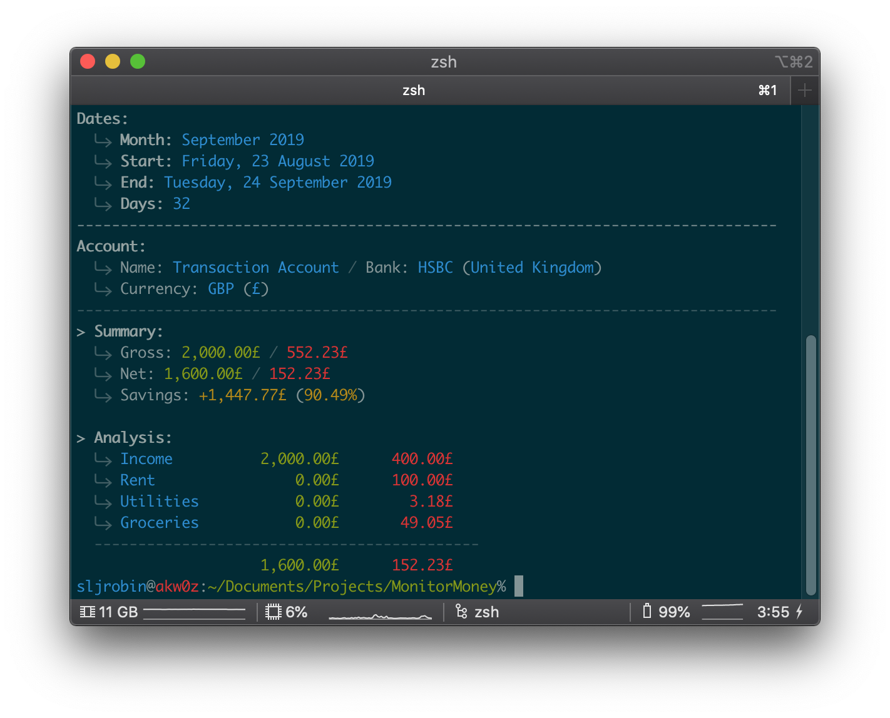
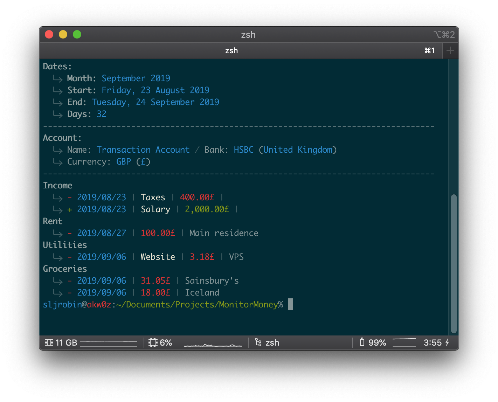
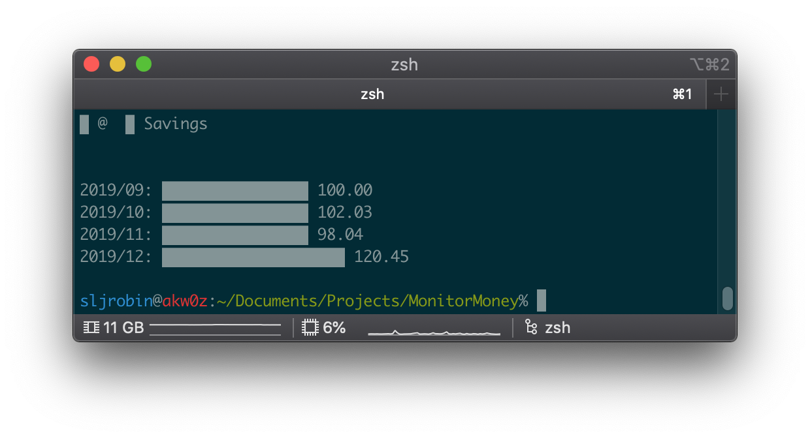

# MonitorMoney
MonitorMoney is a simple monitor to handle private expenses. With two given dates, it allows to perform different analyses, print statements or show graphs (cf. [Screenshots](#screenshots) below).

* [Getting Started](#getting-started)
    * [Installation](#installation)
    * [Edit Preferences](#edit-preferences)
    * [Edit Statement](#edit-statement)
* [Usage](#usage)
    * [Action: `generate`](#action-generate)
    * [Action: `statement`](#action-statement)
    * [Action: `analysis`](#action-analysis)
    * [Other Actions (with `Makefile` only](#other-actions-with-makefile-only)

## Screenshots
### Analysis


### Statement


### Graph


## Getting started
### Installation
* Download the repository: `git clone https://github.com/sljrobin/MonitorMoney`
* Create and activate a [Python virtual environment](https://docs.python.org/3/library/venv.html):
    * `virtualenv create venv`
    * `source venv/bin/activate/`
* Install the requirements with [`pip3`](https://pypi.org/project/pip/): `pip install -r requirements.txt`

### Edit Preferences
* Edit the [`preferences.json` file](./data/preferences/preferences.json)
* Dates of months can be edited as follow:

```json
"2019":{ 
  "september":{
    "start":"2019-08-23",
    "end":"2019-09-24"
  }
}
```

* Expense categories can be added as follow:

```json
"categories":{ 
  "income":[ 
    "salary",
    "savings",
    "taxes"
  ],
  "rent":[]
}
```

### Edit Statement
By default, statements are stored as `<statement_name>.json` in `data/statements/<ISO country code>/<bank>/`


## Usage
Different actions are available (cf. below). They can be performed by calling the file `monimoney.py` (e.g. `python3 monimoney.py generate --rule=2019-Dec`) or with the `Makefile` (e.g. `make generate --rule=2019-Dec`)

* `create`: shows the different categories and subcategories and generates the JSON for the database. The generated JSON needs to be manually copied and pasted.
* `generate`: with dates defined in the [`preferences.json` file](./data/preferences/preferences.json), this action generates rules for `Makefile`.
* `statement`: shows all transactions of a statement.
* `analysis`: calculates totals and shows an analysis of a statement.

### Action: `generate`
#### Commands
* `make generate month=<yyyy-mmm>`
* `python3 monimoney.py generate --rule=<yyyy-mmm>` 

#### Examples
* `make generate month=2019-Dec`
* `python3 monimoney.py generate --rule=2019-Dec`

### Action: `statement`
#### Commands
* `make <yyyy-mmm_statement>`
* `make <yyyy-mmm_statement-all>`
* `python3 monimoney.py statement --start=<yyyy-mm-dd> --end=<yyyy-mm-dd> --statement=<path>`
* `python3 monimoney.py statement --start=<yyyy-mm-dd> --end=<yyyy-mm-dd> --all`

#### Examples
* `make 2019-sep_statement`
* `make 2019-sep_statement-all`
* `python3 monimoney.py statement --start=2019-01-01 --end=2020-01-01 --statement=./data/statements/gb/hsbc/account.json`
* `python3 monimoney.py statement --start=2019-01-01 --end=2020-01-01 --all`

### Action: `analysis`
#### Commands
* `make <yyyy-mmm_analysis>`
* `make <yyyy-mmm_analysis-all>`
* `python3 monimoney.py analysis --start=<yyyy-mm-dd> --end=<yyyy-mm-dd> --statement=<path>`
* `python3 monimoney.py analysis --start=<yyyy-mm-dd> --end=<yyyy-mm-dd> --all`

#### Examples
* `make 2019-sep_analysis`
* `make 2019-sep_analysis-all`
* `python3 monimoney.py analysis --start=2019-01-01 --end=2020-01-01 --statement=./data/statements/gb/hsbc/account.json`
* `python3 monimoney.py analysis --start=2019-01-01 --end=2020-01-01 --all`

### Other Actions (with `Makefile` only)
* `make convert`: converts savings in GBP to EUR
* `make edit`: opens all statements for editing
* `make graph`: creates a graph of savings
* `make last`: starts the last analysis of the current month for the preferred account
    * __Note__: this rule needs to be edited every month accordingly
